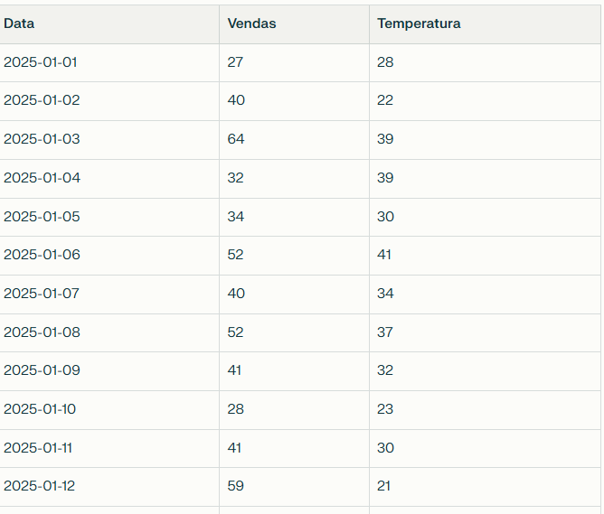
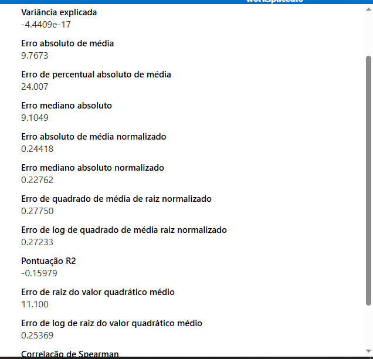

# Previsão de Vendas com Regressão Linear Usando Temperatura

## Introdução
Neste projeto, exploramos a predição de vendas de sorvete baseadas pela temperatura explorando dois serviços distintos da azure: Azure AutoML e o Pipeline Designer

## Contexto e Motivação
Vendas muitas vezes variam conforme a temperatura, especialmente em produtos sazonais ou sensíveis ao clima, diate disso, exploramos os serviços Azure para gerar o melhor modelo que possa predizer vendas baseadas pela temperatura.

## Pergunta de Pesquisa
Quais são os dias que posso prever uma alta de vendas? 

## Dados
- Fonte: Registro diário de vendas e temperatura ambiente - gerados pelo perplexityAI para fins de estudo

- Parâmetros: Temperatura (°C) e Vendas (unidades).

- Target: Vendas (unidades).

## Modelagem
- Método: Mean Squared Error - MSE - métrica comum em regressão linear para avaliar o quanto as previsões se afastam dos valores reais, ou seja, o modelo com os valores mais próximos dos reais tem uma maior confiabilidade

## Resultados
AutoML gerou um Job, no qual, o modelo com maior desempenho gerou uma metrica de MSE de 0,27750, indica que o desvio médio ao quadrado entre o que o modelo prevê e o que foi observado é relativamente pequeno, significando um bom ajuste, dependendo da escala das vendas.

**AutoML**

**Pipeline Designer**

Contudo ambos os modelos apresentam uma disparidade nas métricas, pois, o RMSE é a raiz do MSE, o valor do RMSE em ambos modelos são maiores que 11, diferente do valor da raiz da métrica de MSE dos dois modelos, que se aproximaria de 0,53.

## Conclusões e Próximos Passos

Os modelos apresentam bom desempenho para uma base de dados pequena e demonstram valores com uma margem de erro de 11 unidades de vendas para cada dia

## Referências
- Técnicas de regressão linear: https://www.freecodecamp.org/portuguese/news/aprendizagem-da-maquina-uma-introducao-ao-erro-quadratico-medio-e-linhas-de-regressao/
- Exemplos e fundamentos de storytelling com dados.

